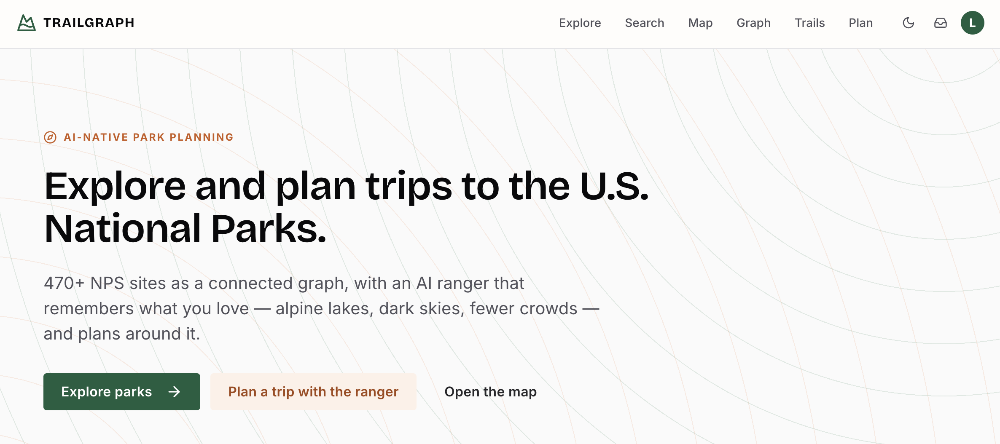
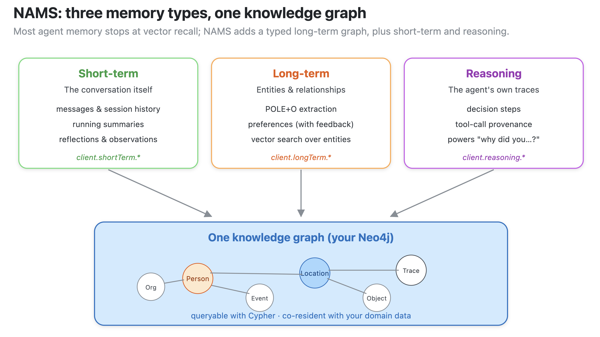
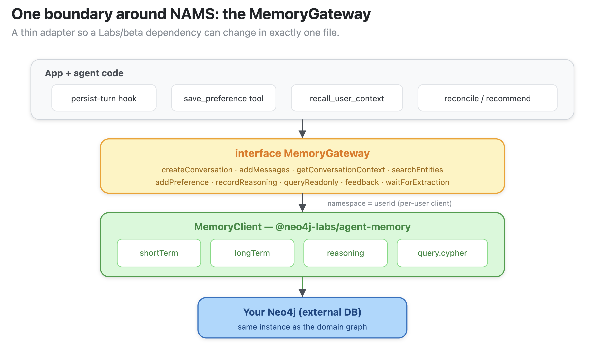
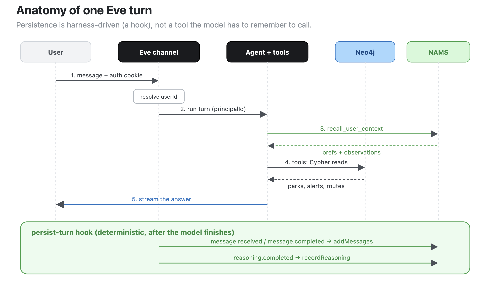
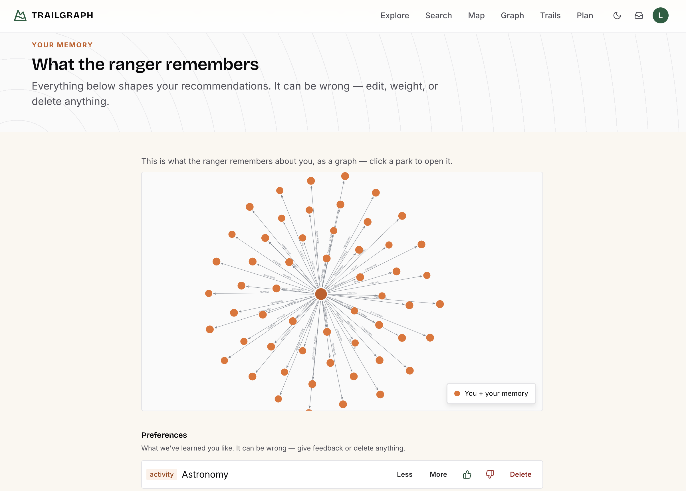
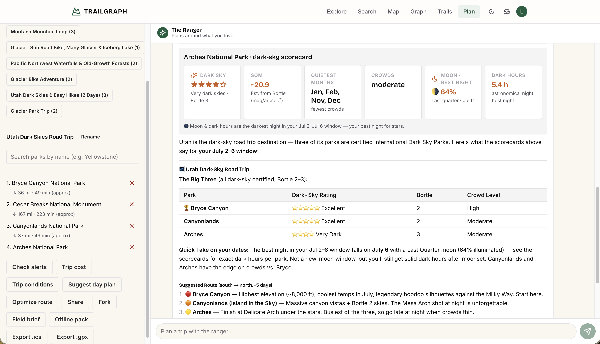
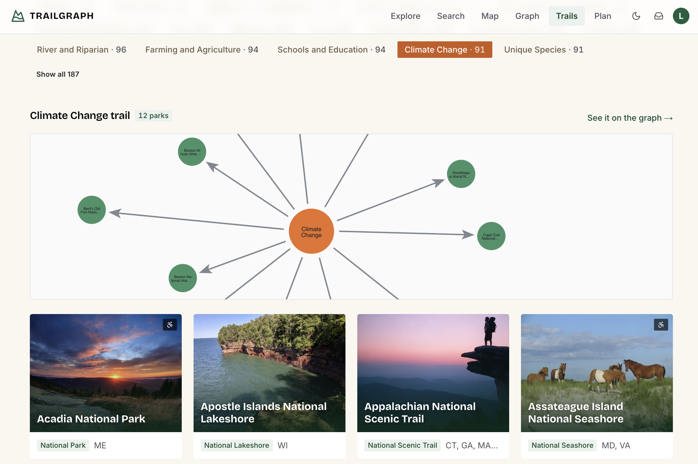
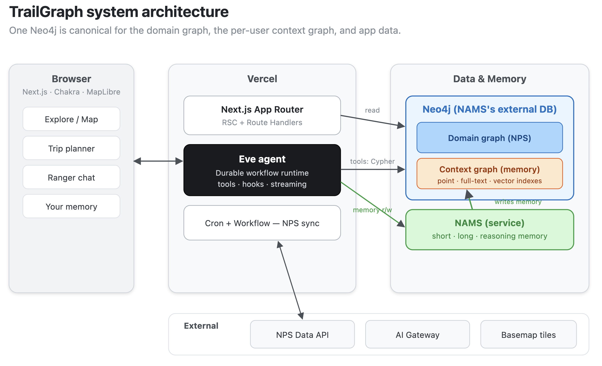
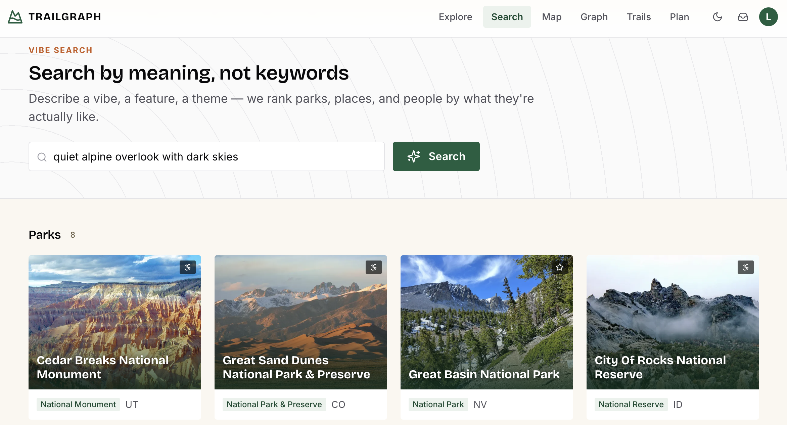

# 🏞️ TrailGraph

**An AI trip planner for the U.S. National Parks — and a reference app for giving a [Vercel Eve](https://vercel.com/) agent a real, graph-native memory with the [Neo4j Agent Memory Service (NAMS)](https://memory.neo4jlabs.com).**

[](https://trailgraph.app)

[TrailGraph](https://trailgraph.app) turns the National Park Service's open data into a connected graph you can explore, plan
trips on, and chat with — through an AI "ranger" that actually remembers what you love. The interesting
part isn't the chatbot; it's *how the agent remembers*: **Eve** runs the agent, **NAMS** gives it
memory, and both sit on a **single Neo4j** so the agent can traverse straight from *"this user loves
dark skies and quiet trails"* to the specific parks, campgrounds, and routes that fit.

> If you're here to learn the pattern, jump to **[How Eve + NAMS fit together](#-how-eve--nams-fit-together)**.

---

## The big idea: a context graph



Most "agent memory" is a pile of embedded text snippets. TrailGraph uses the more complete idea — a
**context graph**: a connected, queryable memory of the user *and* the world, in the same database as
your domain data.

- **One Neo4j, two graphs.** The NPS **domain graph** (parks ↔ activities ↔ topics ↔ campgrounds ↔
  alerts ↔ places ↔ people ↔ tours ↔ amenities ↔ passport stamps ↔ events) and each user's **context
  graph** (preferences, considered parks, trips, accessibility constraints, passes, stamps, and the
  agent's own reasoning) live in the **same instance**. NAMS is pointed at that same Neo4j as its
  workspace store, which is the decision that unlocks everything else.
- **Memory that's a graph, not a transcript.** NAMS captures three memory types — **short-term**
  (conversation), **long-term** (entities + preferences, extracted automatically), and **reasoning**
  (the agent's decision/tool-call traces, the rare one that powers honest "why did you suggest this?").
- **Cross-graph traversal.** Because both graphs are co-resident, a recommendation is a single Cypher
  hop — `(:User)-[:PREFERS]->(:Activity)<-[:OFFERS]-(:Park)` — not a join across two systems. That's
  something a chatbot-over-an-API simply can't do.

---


## ✨ How Eve + NAMS fit together



This is the part worth copying into your own Eve app. Each pattern is one small, real file.

### 1. One boundary around NAMS — [`lib/memory.ts`](lib/memory.ts)
Every memory call goes through a `MemoryGateway` interface; the only file that imports the
`@neo4j-labs/agent-memory` SDK is the adapter behind it. Per-user isolation is enforced by constructing
**one `MemoryClient` per user** with `namespace = userId`.

### 2. Persist every turn the right way — [`agent/hooks/persist-turn.ts`](agent/hooks/persist-turn.ts)
Persistence is an **Eve hook** on `message.received` / `message.completed` / `reasoning.completed`, not
a tool the model has to remember to call. Memory becomes a runtime guarantee instead of a hope, and a
slow memory write never blocks the user's turn.



### 3. Server-bound identity — [`lib/eve-auth.ts`](lib/eve-auth.ts) · [`agent/channels/eve.ts`](agent/channels/eve.ts) · [`lib/agent-ctx.ts`](lib/agent-ctx.ts)
The signed-in [Better Auth](https://www.better-auth.com/) user flows from the request cookie → the Eve
channel's auth function → `ctx.session.auth.current.principalId`. **No tool accepts a `userId`**, so the
model can't spoof whose memory it touches.

### 4. Cross-graph bridges — [`lib/bridges.ts`](lib/bridges.ts) + [`lib/canonicalize.ts`](lib/canonicalize.ts)
When a user states a preference, we write the raw fact to NAMS **and** a deterministic
`(:User)-[:PREFERS]->(:Activity|:Topic)` edge into the graph — canonicalizing free text ("dark skies")
to a real domain node (`:Activity {name:"Astronomy"}`). The edge keeps the user's original words for
honest explanations and makes personalization show up instantly. Every new domain node type becomes a
new bridge target: the context graph now also captures **how you travel** (`TRAVELS_WITH` a
`:Constraint`, `REQUIRES` an `:Amenity`), passes you hold (`HOLDS`→`:EntrancePass`), stamps you've
collected (`COLLECTED`→`:PassportStamp`), and your travel window (`AVAILABLE`→`:Season`) — so a single
traversal can satisfy *and explain* an accessibility- and pass-aware recommendation.

### 5. Memory beyond the chat box — [`lib/recommend.ts`](lib/recommend.ts) · [`lib/explain.ts`](lib/explain.ts)
Because the context graph is just data in Neo4j, the homepage "For you," the map defaults, and the
"because you liked…" rationale all read the same preferences the ranger does — not only the agent.



### 6. The graph, made visible — [`components/graph/NvlGraph.tsx`](components/graph/NvlGraph.tsx)
The `/graph` constellation and an interactive one-hop graph on every park page are rendered with the
**Neo4j Visualization Library (NVL)** — the engine behind Neo4j Bloom — so the product *looks* like the
graph it is.

A companion deep-dive on this integration is written up as a blog post [here](https://lyonwj.com/blog/agent-memory-with-eve-and-nams).

---

## What you can do



- **Explore** 470+ NPS sites with full-text + faceted search (activity, topic, **amenity**, state,
  dark-sky), and a personalized **"For you"** rail.
- **Search** (`/search`) — one query box, **semantic** results across parks, **places** (17k POIs), and
  **people** (historical figures), ranked by meaning via per-node vector embeddings.
- **Map** every site on a clustered MapLibre map with layer toggles (campgrounds, visitor centers,
  things-to-do, active alerts) loaded by viewport, plus real **park boundary** overlays on detail maps.
- **Read the map, don't just look at it** — switch the labeled vector basemap between **Topo** and
  **Dark**, then recolor every park by a **data lens** (dark sky, crowds, entry fee, or accessibility)
  or by **live conditions** (weather + road events), so the map answers a question instead of plotting
  dots.
- **See the graph on the map** — toggle **park-to-park edges** (the materialized `NEAR` proximity graph
  plus shared-topic / shared-activity links) to trace journeys across the country, and flip on
  **"your map"** to light up the parks you've considered and the passport stamps you've collected.
- **Ask the map** — a **ranger command bar** turns "dark-sky parks near Moab" into a focused, filtered
  view, and you can **build a trip right on the canvas**: click parks to add stops, watch live
  drive-time / mileage metrics, and drag to reorder.
- **Take it into the field** — generate an **offline pack** (boundaries + POIs zipped for the area), a
  printable **field sheet**, or a **share-a-view** deep link that reopens the exact map someone else was
  looking at.
- **Fly the parks in 3D** — with optional terrain enabled, trip routes and the `/journeys` story tour
  become cinematic **3D fly-throughs** (gracefully flat, pitched 2D when no elevation source is set).
- **Plan** multi-park, multi-day trips with drive segments, day-by-day pacing, graph-aware route
  optimization, per-trip alert checks, **date-aware open/closed validation** (`check_open` flags a road
  or facility that's closed on your travel dates), a **real fees/passes budget** (per-vehicle/person/
  motorcycle entrance fees summed from NPS data, with the America-the-Beautiful break-even and fee-free-day
  nudges), shareable read-only links, and `.ics` export — or **seed a trip from an official NPS tour**.
- **Trails** (`/trails`) — real, hikeable **trails** by length, elevation, difficulty, dogs,
  accessibility, and season (from NPS Public Trails GIS; elevation derived from a DEM).
- **Journeys** (`/journeys`) — cross-park **thematic journeys** connected by a historical figure or a
  shared topic, highlighted on the graph constellation, with a scrollytelling 3D tour.
- **Chat** with the **ranger**, which recalls your preferences, recommends parks with reasons, builds
  trips, finds places/people semantically (`find_place`/`find_person`), and respects how you travel —
  remembering what you like across sessions.
- **Plan for how *you* travel** — tell the ranger you use a wheelchair, travel in a 30-ft RV, need a
  specific amenity, hold an annual pass, or are going in September, and every later recommendation,
  itinerary, and cost honors it — with provenance ("has a wheelchair-accessible campground").
- **Collect** passport stamps and see events that land during your travel window, per park.
- **Your memory** (`/me`): see, tune (boost/down-rank), and delete everything the app remembers —
  preferences, considered parks, trips, travel constraints, passes, stamps, and dates — with durable
  deletes (tombstones) so extraction won't resurrect them.
- **Conditions** on each park: dark-sky/Bortle rating, best months + a monthly-visitation chart, trail
  difficulty/length, current weather, timed-entry, **operating hours + seasonal closures**, an
  **accessibility scorecard** (reported features across places/campgrounds/trails/parking), **parking +
  EV charging**, the **latest NPS news releases**, and live **webcams + road events** — graph-native
  or on-demand behind swappable adapters.
- **Nearby & regional** discovery: a materialized `NEAR` proximity graph and curated geographic
  `:Region`s seed tighter multi-park trips ("what else is within range of Mesa Verde?").
- **Dark mode** (system-aware, with a toggle in the nav) across the whole app, including the map basemap.



---

## Tech stack



| | |
|---|---|
| **Framework** | Next.js (App Router, RSC) · React · TypeScript |
| **Agent** | [Eve](https://vercel.com/) (durable agent runtime) · AI Gateway |
| **Memory** | [NAMS](https://neo4j.com/labs/) — `@neo4j-labs/agent-memory`, hosted, on an external Neo4j |
| **Database** | Neo4j (domain graph + context graph + app data) |
| **Search** | Neo4j full-text + faceted, and semantic vector search (parks/places/people) via AI Gateway embeddings |
| **Auth** | Better Auth (passwordless magic link) |
| **UI** | Chakra UI v3 — custom *"Topographic Adventure"* theme (`theme/`: pine/trail/sand tokens, light-first dark mode, recipes) · Bricolage Grotesque + Inter (`next/font`) · `react-icons` · MapLibre GL + Protomaps · Neo4j NVL · Recharts |
| **Routing** | OpenRouteService (drive segments) |

---

## Getting started

**Prerequisites:** Node 20+, `pnpm`, a Neo4j 5.x instance, an
[NPS API key](https://www.nps.gov/subjects/developer/get-started.htm), a NAMS workspace + API key
(pointed at your Neo4j), and an AI Gateway key.

```bash
cp .env.example .env.local        # NPS, Neo4j, NAMS, Eve/AI Gateway, auth, routing keys
pnpm install
pnpm db:migrate                   # constraints + point / full-text / vector indexes
pnpm nams:spike                   # ✅ proves NAMS writes land in YOUR Neo4j (the core bet)
pnpm dev                          # Next + the Eve ranger together — open http://localhost:3000/plan
```

Then populate the domain graph from the NPS API: `curl "http://localhost:3000/api/sync?tier=all"`
(and `pnpm datasources:sync` for the dark-sky / crowds / trail-difficulty conditions). The sync is
**resumable and rate-limit-tolerant** — large resources page-and-checkpoint, so a `429` pauses (saving
a cursor) and the next run continues; the response reports `{paused:[…]}`. It also embeds `:Place`/
`:Person` for semantic search (content-hash gated); add `EMBED_ARTICLES=1` to also embed the ~19k
articles. The sync also promotes the rich NPS payloads it already downloads into queryable nodes —
operating hours + seasonal closures, structured entrance fees, campground inventory, event recurrence,
accessibility, news releases, and a `NEAR`/region graph (see [`docs/DECISIONS.md`](docs/DECISIONS.md)
ADR-059). Self-guided audio + multimedia is opt-in behind `SYNC_MULTIMEDIA=1` (large, off by default).
`pnpm sync:reset <resource>…` clears specific checkpoints to force a re-sync.

> `pnpm dev` auto-starts the Eve agent behind the app via Eve's `withEve`. To run the app **without** the
> agent (just Explore / Map / Plan UI): `DISABLE_EVE=1 pnpm dev`.

**Maps:** with no setup, maps fall back to MapLibre demo tiles. For a real terrain basemap, build a
self-hosted Protomaps extract:

```bash
brew install pmtiles   # go-pmtiles CLI
PMTILES_SOURCE=https://build.protomaps.com/<YYYYMMDD>.pmtiles pnpm build:basemap
```

This writes `public/basemap/us.pmtiles` (gitignored; host it on a CDN for production — see below). Any
MapLibre `style.json` URL works in `NEXT_PUBLIC_MAP_TILES_URL` too.

**Labels work with zero setup.** The map's label-font glyphs are **self-hosted and committed** (the Noto
Sans PBFs under `public/basemap/fonts/`, regenerated with `pnpm build:glyphs`) and served same-origin, so
park / city / road names render even before you build a basemap — there's no third-party glyph host to
404 and silently drop every label. To serve glyphs from your own CDN instead, point
`NEXT_PUBLIC_MAP_GLYPHS_URL` at a `{fontstack}/{range}.pbf` template.

**3D terrain is optional (off → flat).** Maps render flat by default. Set `NEXT_PUBLIC_MAP_TERRAIN_URL`
to a raster-DEM tile template (`…/{z}/{x}/{y}.png`) or a TileJSON URL to enable 3D terrain and the trip /
`/trails` fly-throughs — AWS's open **Terrarium** elevation tiles
(`https://elevation-tiles-prod.s3.amazonaws.com/terrarium/{z}/{x}/{y}.png`) are a good free default. The
encoding defaults to `terrarium` (override with `NEXT_PUBLIC_MAP_TERRAIN_ENCODING`); set
`NEXT_PUBLIC_MAP_TERRAIN_ATTRIBUTION` for the credit line. Whatever DEM host you choose, **add it to both
`img-src` and `connect-src`** in the `next.config.ts` CSP (the AWS host is allowed out of the box). With
the env unset every terrain hook is a no-op, so fly-throughs degrade to flat, pitched 2D camera moves.

---

## Deploy to Vercel

Because the ranger is wired in with **`withEve(nextConfig)`** (`next.config.ts`), the agent and the app
**compile and deploy together as one ordinary Vercel app** — there's no separate `eve build`/`eve deploy`
step (those are for standalone agent projects). The build command stays `next build`.

1. **Push to GitHub and import the repo in Vercel** (or `vercel --prod` from the CLI). Vercel
   auto-detects Next.js; leave the build command as the default.
2. **Set environment variables** (Production) — everything in `.env.example`:
   - `NEO4J_URI`/`USERNAME`/`PASSWORD`/`DATABASE` — reachable from Vercel (e.g. **Neo4j Aura**,
     `neo4j+s://…`).
   - `NAMS_API_KEY` + `NAMS_WORKSPACE_ID` — the NAMS workspace must point at **that same Neo4j**
     (the context-graph bet). Leave `NAMS_BASE_URL` blank.
   - `NPS_API_KEY`; `BETTER_AUTH_SECRET` + `BETTER_AUTH_URL=https://<your-domain>`; `RESEND_API_KEY` +
     `EMAIL_FROM`; `ORS_API_KEY`.
   - `AGENT_MODEL` / `EMBEDDING_MODEL`. On Vercel, **models resolve through AI Gateway via the project's
     OIDC token**, so `AI_GATEWAY_API_KEY` is only needed locally. The Eve channel admits Vercel
     deployments through `vercelOidc()` (`agent/channels/eve.ts`). **Do not set `EVE_BASE_URL`.**
   - `CRON_SECRET` — Vercel sends it as the `Authorization: Bearer` on cron calls; `/api/sync` checks it.
   - `NEXT_PUBLIC_MAP_TILES_URL` — the Blob URL from the next section.
3. **Deploy.** The scheduled jobs in [`vercel.json`](vercel.json) start automatically: a once-daily
   full sync (`/api/sync?tier=all` — corpus + alerts/events + data sources) and a once-daily memory
   reconcile. This fits **Vercel Hobby** (≤2 cron jobs, daily). On Pro you can split into more frequent
   `tier=slow`/`tier=fast` schedules. `/api/sync`'s long runtime comes from its route-segment
   `export const maxDuration` (Fluid Compute / Pro).
4. **One-time data setup** against the production Neo4j (run locally with prod `NEO4J_*` in
   `.env.local`): `pnpm db:migrate` · `pnpm ontology:setup` · `pnpm nams:spike`, then seed the graph
   (`curl -H "Authorization: Bearer $CRON_SECRET" "https://<your-domain>/api/sync?tier=all"` and
   `pnpm datasources:sync`).

### Host the basemap on Vercel Blob (CDN)

The `.pmtiles` file is too large for a deploy bundle (and is gitignored). Put it on **Vercel Blob**,
which serves it from Vercel's CDN with the HTTP range support PMTiles needs:

```bash
# 1) Create a Blob store: Vercel dashboard → Storage → Blob, then expose its token locally:
vercel env pull .env.local            # provides BLOB_READ_WRITE_TOKEN  (or export it manually)
# 2) Build + upload (streamed multipart; stable URL):
pnpm build:basemap                    # → public/basemap/us.pmtiles
pnpm basemap:upload                   # → prints https://<store>.public.blob.vercel-storage.com/basemap/us.pmtiles
# 3) Set NEXT_PUBLIC_MAP_TILES_URL to that URL in the Vercel project (Production) and redeploy.
```

`basemap:upload` verifies the uploaded URL answers a `Range` request with `206` before you wire it up.

> **Use the public URL printed above, exactly — `*.public.blob.vercel-storage.com/…` with no query
> string.** Do **not** paste a `*.private.blob…` host or a signed `?vercel-blob-delegation=…` download
> URL (e.g. from the Blob dashboard): those are served through Blob's auth proxy, which **ignores HTTP
> range requests** — so every client downloads the *entire* hundreds-of-MB `.pmtiles` file — and the
> signed token **expires ~12h** after each deploy, dropping all users to demo tiles.

Re-run `build:basemap` + `basemap:upload` to refresh tiles (the object name is stable, so the URL
doesn't change). The map falls back to demo tiles automatically if the URL is unset or unreachable.

---

## Project structure

```
app/         Next.js App Router — pages + Route Handlers (/api/auth, /api/sync, /api/trips, …)
agent/       Eve agent — instructions.md, agent.ts, tools/, channels/eve.ts, hooks/persist-turn.ts
lib/         adapters + domain logic — memory (NAMS), neo4j, bridges, recommend, queries, datasources/
theme/       Chakra design system — tokens, semantic tokens, recipes, textures (brand: pine/trail/sand)
components/  UI — chat, plan, graph (NVL), map, park, memory, ui/ (primitives)
db/          Cypher migrations + migrate/verify runners
scripts/     seed, ontology setup, basemap build, data-source sync, the NAMS spike
evals/       Eve eval suite
tests/       integration (real Neo4j, gated) + e2e (Playwright)
```

---

## Testing

```bash
pnpm typecheck
pnpm test:unit                          # pure logic, mocked I/O — runs anywhere
RUN_INTEGRATION=1 pnpm test:integration # real Neo4j (CI uses an ephemeral container) — never prod
pnpm test:e2e                           # Playwright — builds + serves a prod build; needs a seeded Neo4j: pnpm seed:test
```

Unit tests cover the pure logic (recommendation ranking, canonicalization, route ordering, ICS, the
data-source derivations, **the NPS data-feature parsers** — operating-hours/open-closed, fee units,
campsite inventory, event-date expansion, accessibility/region derivation, contacts, trail metrics —
NVL data mapping, brand-color resolution, server-bound identity). Integration tests exercise the real
graph (domain queries, the trip service, cross-graph recommendations, the Better Auth adapter, memory
delete + tombstones, sharing, and **the data features end-to-end** in
`tests/integration/nps-data-features.itest.ts`: `check_open`, the fee budget, the fixed campground
`HAS_AMENITY` edge, the accessibility scorecard, news/article search, regions + `NEAR`). E2E covers the
public surface (incl. the new park-page hours/accessibility/news/parking blocks in
`tests/e2e/nps-data-features.spec.ts`) and an authenticated trip-building flow — run against a
**production build** (`pnpm build && pnpm start`), because Chakra's Emotion SSR only yields a trustworthy
hydration signal in prod (dev emits class-hash false positives).

---
"


  


> ⚠️ TrailGraph is a demo, **not** an official NPS safety source — always defer to NPS.gov and rangers
> for life-safety decisions.

Built with Neo4j · Eve · NAMS. National Park data courtesy of the [NPS Data API](https://www.nps.gov/subjects/developer/index.htm).
